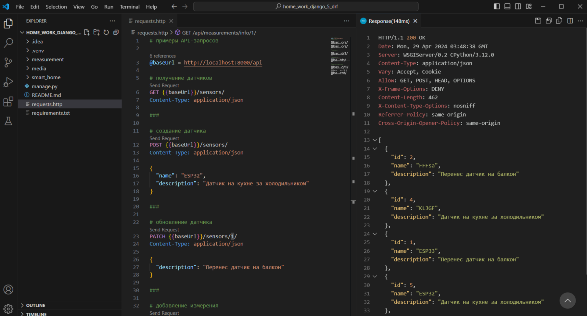
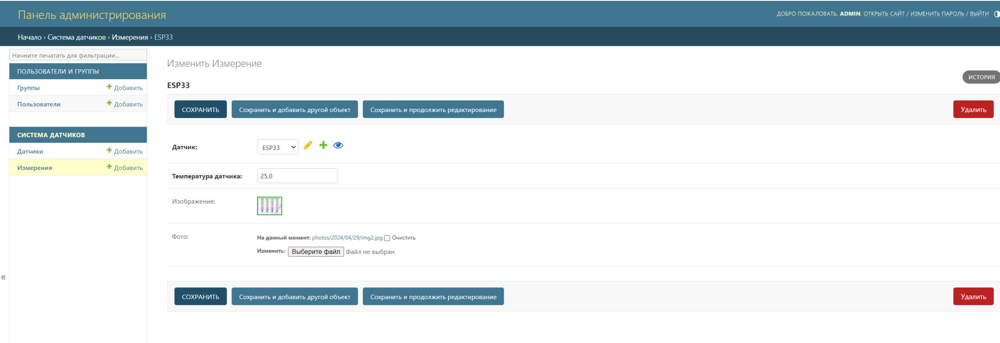
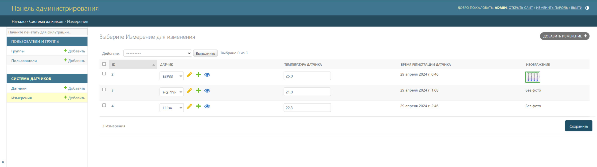
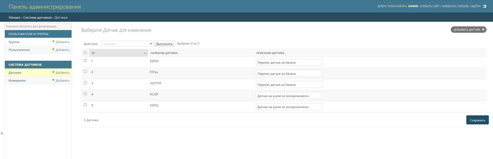

# Домашнее задание "Знакомство с API на примере Django REST framework"

## Порядок работы

Запросы можно делать из файла [requests.http](./requests.http).



### Так же заполнять БД, редактировать записи, добавлять изображения к записанным измерениям,привязывать измерения к датчикам и т.п. можно из админ-панели





# Умный дом

## Техническая задача: реализовать некоторые действия из CRUD, используя Django Rest Framework.

**CRUD** — аббревиатура для Create-Read-Update-Delete. Ей обозначают логику для операций создания-чтения-обновления-удаления сущностей. Подробнее: https://ru.wikipedia.org/wiki/CRUD.

## Описание

У нас есть программируемые датчики, измеряющие температуру. Раз в некоторый интервал времени датчики делают запрос по API и записывают свои показания. В показания датчики передают свой ID и текущую температуру в градусах Цельсия.

Необходимо реализовать REST API для добавления и изменения датчиков, их просмотра и добавления новых измерений температуры.

Требуется задать две модели — они уже описаны в models.py:

- датчик:

  - название,
  - описание (необязательное, например, «спальня» или «корридор на 2 этаже»).

- измерение температуры:

  - ID датчика,
  - температура при измерении,
  - дата и время измерения.

Для сериализаторов используйте `ModelSerializer`.

---

Запросы, которые должны быть реализованы в системе:

1. Создать датчик. Указываются название и описание датчика.
2. Изменить датчик. Указываются название и описание.
3. Добавить измерение. Указываются ID датчика и температура.
4. Получить список датчиков. Выдаётся список с краткой информацией по датчикам: ID, название и описание.

```json
[
  {
    "id": 2,
    "name": "ESP32",
    "description": "Датчик на кухне за холодильником"
  },
  {
    "id": 1,
    "name": "ESP32",
    "description": "Перенес датчик на балкон"
  }
]
```

5. Получить информацию по конкретному датчику. Выдаётся полная информация по датчику: ID, название, описание и список всех измерений с температурой и временем.

```json
{
  "id": 1,
  "name": "ESP32",
  "description": "Перенес датчик на балкон",
  "measurements": [
    {
      "temperature": 22.3,
      "created_at": "2021-10-23T16:44:51.432328Z"
    },
    {
      "temperature": 22.5,
      "created_at": "2021-10-23T16:45:51.091212Z"
    }
  ]
}
```

Примеры запросов можно посмотреть в файле [requests.http](./requests.http).


## Дополнительные задания

### Прикрепление картинки к измерению

Датчики стали более продвинутыми и могут также прикреплять снимки. Добавьте nullable-поле к модели `Measurement` для сохранения изображений. https://www.django-rest-framework.org/api-guide/fields/#imagefield

Обратите внимание, что поле должно быть опциональным — некоторые датчики прикладывают фото, а некоторые — нет. Для старых датчиков ничего не должно сломаться.

## Документация по проекту

Для запуска проекта необходимо

Установить зависимости:

```bash
pip install -r requirements.txt
```

Вам необходимо будет создать базу в postgres и прогнать миграции:

```base
python manage.py migrate
```

Выполнить команду:

```bash
python manage.py runserver
```